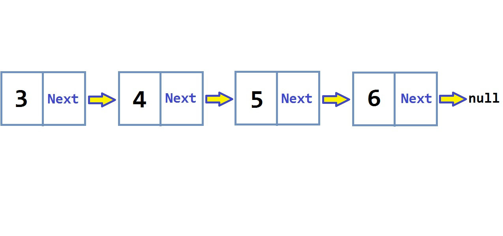

# CS50 Section. Week 6. 10/4/16.
*Tuesdays 4-5:30 PM, CGIS S-040*  

> Nicholas Boucher
> nboucher@college.harvard.edu  

# Section Agenda

1. Notes from Past P-Set
2. Structures
3. Linked Lists
4. Hash Tables
5. Tries
6. Stacks/Queues
7. Huffman Coding

# Notes from Past P-Set

## Newlines

Beware of placing unnecessary newlines into your code. It is good to put one newline between functions, but you do not need more than one. Likewise, it is okay to separate out logical sections of your code within a function by using a newline. However, do not get in that habit of placing lots of blank lines in your code. There is no need for code to be longer than it has to be.

Many students are doing this:

```c
int main(void)
{
  foo();
}


void foo()
{


  printf("My code is messy.\n");

}
```

However, this is how it should be formatted:

```c
int main (void)
{
  foo();
}

void foo()
{
  printf("My code is clean.\n", );
}
```

**Use `style50` before submitting your code.**

## Debugging

Many of the problems that are coming up over email and in office hours can be solved by simply tracing through the program with `debug50`. Try to get in the habit of tracing through the execution flow of your program before asking for help -- you will become a better programmer for it.

However, as always, do not hesitate to reach out over email if you do need help.

# Structures

Structures are a tool that we can use to create new forms of data. These structures are comprised of a collection of other pre-existing types of data (such as `int`s and `char`s). Structures encapsulate data of different data types together because those different pieces of information comprise part of a larger unit.

We normally declare structures in the global scope do that they are accessible throughout the entire program.

Structures are declared using the `struct` keyword. This is an example of a structure declaration:

```c
struct student
{
   char name[40];
   char house[20];
   int year;
};
```

The data type of the structure we have just created is struct student, so if we wish to create a variable of this type, we must:

```c
struct student nicholas;
```

From there, we can assign the *fields* of that variable using the dot (.) operator:

```c
strcpy(nicholas.name, "Nicholas Boucher");
strcpy(nicholas.house, "Mather");
nicholas.year = 2019;
```
## Typedefing

If we do not want to have to type `struct` before the name of our structure every time we declare a variable of that type (e.g. `struct student nicholas;`), we can `typedef` the struct.

`Typedef`ing allows you to declare variables of any type you have designed as if it was an in-built, native type in C. Here is an example of what `typedef`ing looks like:

```c
typedef struct student
{
   char name[40];
   char house[20];
   int year;
} student;
```

This will allow us to simply create a variable of this type such as:

```c
student nicholas;
```

# Linked Lists

So far, we have been forced to use arrays for any time we want to deal with a series of data. Arrays have the drawback that they are a fixed size and cannot change sizes after declaration. It thus becomes difficult to deal with series of an unknown size.

Introducing: Linked Lists. Linked lists allow us to store a virtually unlimited amount of data in a series with the ability to modify, insert, and remove data during runtime.

Linked lists are a clever combination of two recently introduced topics: pointers and structures. Linked lists work by creating a structure which include an element that is a pointer to something *of its own type*. That is, it points to another version of itself. We call each element within this sort of list a *node*. Consider the structure declared below.

```c
typedef struct node
{
    // just some form of data; could be a char* or whatever
    int i;

    // pointer to next node; have to include `struct` since this is a recursive definition
    struct node *next;

}
node;
```

Each node contains a piece of data (or perhaps multiple pieces of data) and a pointer to the next node. When re reach an element whose `next == NULL`, then we know we have reached the end of the list.

The following visualization depicts the high-level picture of how a linked list containing numbers 3,4,5,6 may look:


